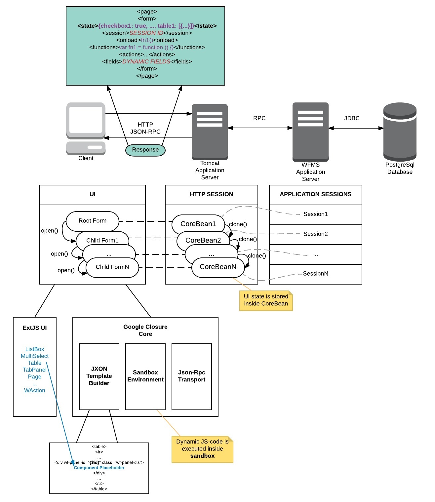

## Web Client for Workflow Management System  

### Description

* Country: **Russia**  
* Company: **E.Soft**  
* Working schedule: **full-time**  
* Duration: **11/2014-01/2015 (3mths)**  
* Position according to employment contract: **Lead programmer**  
* Role: **Software Architect and Principal Front-End Developer**  
* Team: **Alex Poter**  

### Project repository

[Under an agreement with the employer, I have the right to publish the source code for preview here](src)  

**Google Closure Core**  
[Sandbox Environment](src/src/main/webapp/js/workflow/sandbox)  
[Json-Rpc Transport](src/src/main/webapp/js/workflow/transport)  
[JXON Template Builder](src/src/main/webapp/js/workflow/jxon)  
 
**ExtJS UI**  
[WFMS UI](https://github.com/apoterenko/resume/tree/master/scheme/project04/src/src/main/webapp/app/view/main)  
 
**Java Core**  
[Core module](src/src/main/java/ru/esoft/web/ui/core)  
[JsonRpc module](src/src/main/java/ru/esoft/web/ui/jsonrpc)  

### Preview  

  